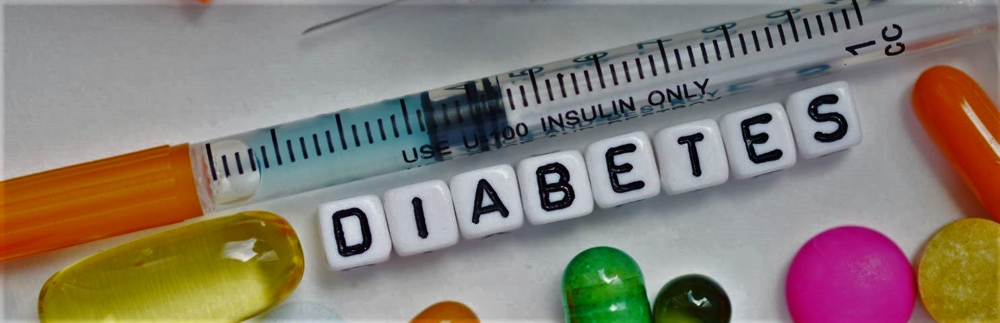

  

  
  
 

<h1>
  DIABETES PREDICTION APP
  
</h1>

<h4>Click <a href="https://drive.google.com/file/d/1uMwU7WSLx0nnKUcP25VvUkig6Gf5gRxn/view?usp=sharing">here</a> to see the app in action</h4>

  

<h2 style="color:red;">DISCLAIMER!</h2>

It is important to note that our app is not a substitute for professional medical advice. If you have concerns about your risk for diabetes or any other health condition, please consult with your healthcare provider. With our Diabetes Prediction App, you can take control of your health and make informed decisions to protect your well-being.

